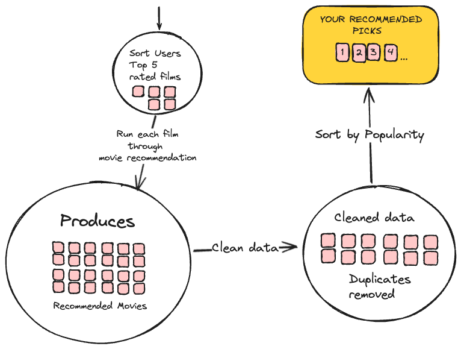
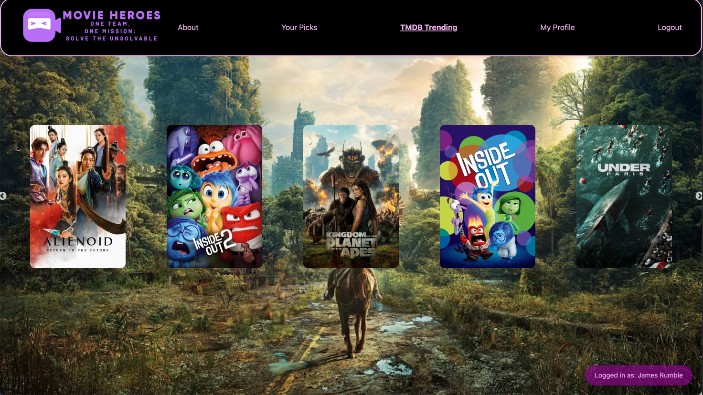

# 

In a world where endless streaming options leave viewers overwhelmed and indecisive, one website rises above the rest. Discover a realm where personalized recommendations and hidden gems are just a click away. Welcome to MovieHero — the ultimate destination for movie lovers. Are you ready to find your next  film? 🍿😎

# 🍿 WATCH A VIDEO DEMONSTRATION FROM THE TEAM 🎬
https://github.com/MrRumble/MovieHeroes/assets/144024793/b1ef3d6e-78af-4ade-9943-eedd63e55bf7

# 🍿 PROJECT OVERVIEW 🎬
Our final project at Makers Academy Bootcamp was a chance to bring together everything we'd learned over the last 12 weeks. Before this, we tackled two full-stack application group projects: Makers B'n'B, our take on vacation rental platforms, and Acebook, our version of a social network.

These projects were great practice and set us up perfectly for the big final project. The difference with this project was that we were able to start from scratch and had complete creative freedom to create anything we liked. As a group, we all agreed that we wanted to work on something related to Machine Learning—a subject none of us had experience in, but one that had piqued our interest.

Initially, we aimed to create a news article sentiment analyzer to track and monitor a population's sentiment on given buzzwords. However, we quickly discovered the limitations of the NewsAPI for free users. So, we went back to the drawing board and came up with the idea of a movie recommendation system. We all have a passion for movies, and after some research, we found that the available resources and data for this project were vast.

We had free access to The Movie Database (TMDb), a comprehensive, user-driven online platform that provides detailed information on movies and TV shows, supported by community contributions and widely used APIs for developers. We also used MovieLens, a research-based online platform developed by GroupLens Research at the University of Minnesota, which provides personalized movie recommendations based on user ratings and preferences.

With these resources at our disposal, we decided that the main purpose of our application would be to provide a smart Movie Recommendation system to our Movie Heroes users, based on the films they have previously rated on our app.

However the ultimate goal over the 10 days was to be able to answer "yes" to the question: **Can you use high-quality processes to build an extended project in a team?**

## THE TEAM
[Anna Kontaratou](https://github.com/Anko21) -
[James Rumble](https://github.com/MrRumble) -
[Jet Siva](https://github.com/jetheesan) -
[Manith Hettiarachchilage](https://github.com/manith-hetti) -
[Selva Ramanathan](https://github.com/melva0333)

## TECH STACK
(STILL TO ADD)
# 🍿 MACHINE LEARNING 🎬

## CHOSEN MODEL
 (STILL TO ADD)
## FINAL TOUCHES
- So we now have a smart movie recommendation model which generates a set of similar movies based on user viewing patterns.

- We can now pull this all together on the user front. In our approach we identify and sort their top 5 rated movies, provided they are rated above 4 stars.

- Each of these top-rated movies is processed through the recommendation algorithm individually.

- This results in a new list of recommended films.

- We then flatten this list and remove any duplicates.

- Finally, we present these recommendations to the user, prioritized by overall Movie Heroes popularity.

# 🍿 FEATURES 🎬
## LOG IN/SIGN UP
(STILL TO ADD)
## MY PROFILE PAGE
(STILL TO ADD)
## TMDB TRENDING PAGE
(STILL TO ADD)
## YOUR PICKS
The Creme-de-la-creme 😎
(STILL TO ADD)
## MOVIE PAGE (LANDING PAGE/ SEARCH FEATURE)
(STILL TO ADD)
## STYLING
(STILL TO ADD)
# 🍿 WHAT WENT WELL 🎬

## PLANNING
We spent a lot of time planning everything, more than we did in previous projects. We understood the importance of planning well, knowing that not doing so can lead to problems down the line.

From the beginning, we made sure everyone had clear diagrams of each page's design. This made it easy to divide tasks on the Trello board, and merging our work was usually smooth with few conflicts.

Initially, we had a plan for another project on the first day. When we realized the MVP might not work out, we didn't panic. Instead, we started fresh on day two, showing our ability to adapt and keep moving forward.

## TEAM DYNAMICS
We stuck with our initial pairs throughout the project, even though it wasn't planned that way. It turned out to be really productive for us, and we kept rolling out features regularly.

Whenever we got stuck or needed a second opinion, we always leaned on each other for advice.

We had a routine of morning stand-ups at 09:30, afternoon check-ins at 14:00, and a final retro meeting before wrapping up at 17:30. This kept us all on the same page throughout.

Everyone pitched in equally, and we made sure everyone felt comfortable sharing their thoughts and ideas. This teamwork was key to our project's success.

## TECHNICAL IMPLEMENTATION
Using MongoDB cloud for a shared database proved very beneficial for us.

It was especially useful because we had a large dataset, and having everything centralized in one place streamlined our workflow.

While there were a few drawbacks that we'll discuss later, overall, MongoDB cloud helped us achieve our goals effectively.

We successfully reached our MVP and even implemented some of our "nice to have" features, like the search bar, TMDB trending page, and user avatars.

We are all particularly proud of the aesthetic and style of our project, which has an eye-catching cinema vibe that we all love.

# 🍿 CHALLENGES 🎬

## TECH STACK
We went with Python because it's widely used in the industry for data analysis and has plenty of tools and support available, especially for machine learning.

Switching from PostgreSQL to MongoDB Cloud was a bit of a challenge as we adjusted to a new way of managing our database.

Selva, Anna, and Adrian had just wrapped up their modules on JavaScript and React, while Manith and James had recently completed their Java module. This meant Manith and James had to swiftly switch gears and get up to speed/ learn JavaScript and React, while we all had to refresh our knowledge of Python syntax.

These challenges pushed us to learn fast and adapt to new technologies throughout the project, a crucial skill for any aspiring software developer!

## MACHINE LEARNING

We had initially set out to learn, implement, and deploy our own ML algorithm, which in hindsight was quite ambitious, especially considering none of us had prior experience in machine learning; we simply shared a fascination for the subject 😅. Adding to the challenge, we had only 10 days to complete our project. To make it feasible, we heavily relied on abstraction and chose a model that we believed would produce the best results.

## PERFORMACE ISSUES

Our recommendation methods encountered significant slowness, sometimes taking up to 10+ seconds to execute.

This was primarily due to inefficient coding practices and unnecessary repetition of iterations, along with excessive database queries in certain methods.

Given the tight project timeline, we opted to address these issues as a "nice to have."

Nevertheless, overcoming this hurdle provided valuable insights into the critical aspects of efficient code, refactoring, and debugging to pinpoint and resolve performance bottlenecks effectively.

# 🍿 WHERE WOULD WE TAKE THE APP FROM HERE? 🎬
(STILL TO COME)

# 🍿 CONCLUSION 🎬
The journey of our final project was both challenging and rewarding. Through collaborative effort, extensive research, and a shared passion for movies, we successfully developed a sophisticated movie recommendation system. This project not only allowed us to explore the complexities of Machine Learning but also demonstrated our capability to implement high-quality processes in team-based project development.

In our final retro meeting after the two weeks we all agreed how much we had loved working with eachother and expressed hope to collaborate again in the future, even as we now pursue our separate career paths.

Ultimately, we all beleive we successfully answered **"YES!"** to the pivotal question: **Can you use high-quality processes to build an extended project in a team?**, and have showcased our readiness to take on complex tech projects in the future.

